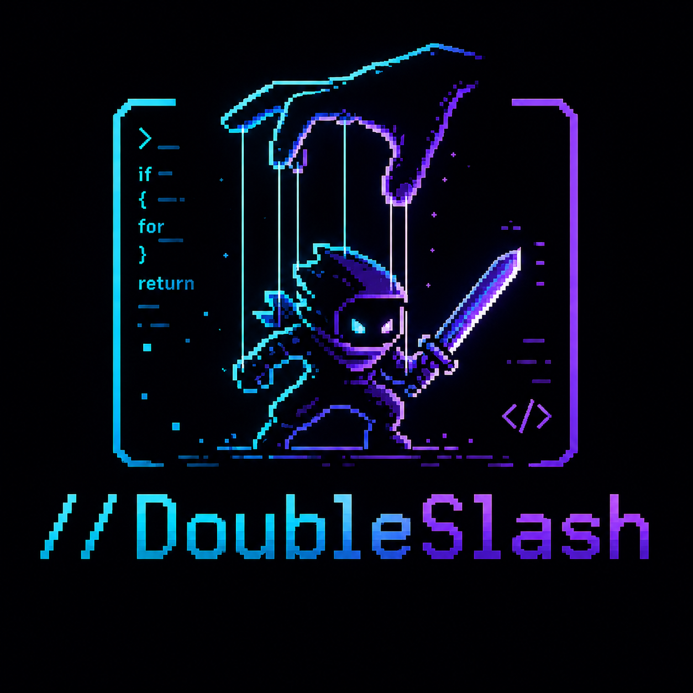
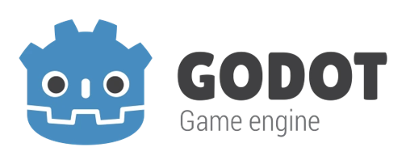
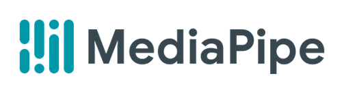
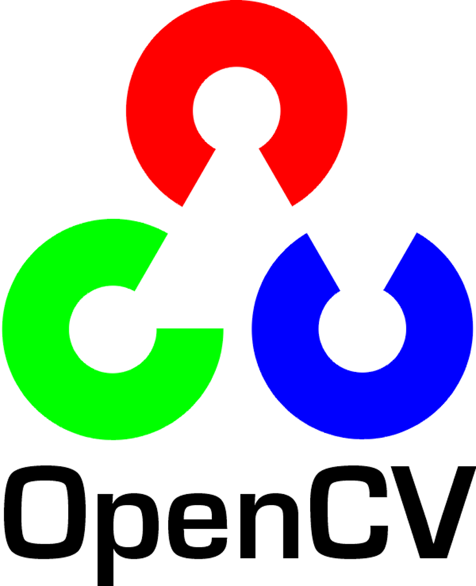
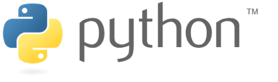

<!-- height or width of logo may be adjusted -->
<!-- This section is where you will replace the link to your transparent logo, the title of your project, and the very short desciptor of your project -->
<!-- If you used Canva to make your icon and don't want to pay for a background remover, you can use the website https://www.remove.bg/ to do so -->
<p align="center">
  
  <h1 align="center">A Combat Game using AI + Webcam that Teaches the Fundamentals of Coding</h1>
  <p align="center">A project for students who want a fun way to learn about coding by team Retro </p>
</p>
<!-- the emojis are not set in stone! If you'd like you can remove them entirely or select your own from https://gist.github.com/rxaviers/7360908 you are welcome to -->

## :loudspeaker: About
The objective of the workshop is to help students learn the fundamentals of coding in a fun and engaging way.
<!-- You can look at other TAP projects if you need a better idea of how to describe your workshops objectives -->

This workshop has participants install the tools needed to run //DoubleSlash and learn the basic data types used in programming. They will also be able to change the values for speed, health, and damage in the code and see real-time changes when they run the game.

## :bulb: Project Information
<!-- 
Your Options for target audience: 
  - High School
  - College
  - Middle School
  - K-12
  - Non-Stem
  - Undergraduate
You can select from a range of audiences or a single auidience. Examples: 
    Middle School - College 
    High School - College
    K-12
  You will be presenting most often to your peers who are taking introductory technology classes, so more often than not you should be including college in your target audience range. 
-->
* <b>Difficulty Level:</b> Intermediate
* <b>Target Audience:</b> K-12, College
* <b>Duration of Workshop:</b> 15 - 60 minutes
* <b>Needed Materials:</b> Computer with keyboard and webcam
* <b>Learning Outcomes:</b> The primary goal of this project is to teach participants the fundamentals of coding.
* <b>Your Main Technology</b> Godot: game engine, MediaPipe: machine learning AI, OpenCV: computer vision, Python: programming language, Pixilart: drawing application for game sprites/tiles
* [Technology Ambassador Program](https://tapggc.org/) <b>(TAP)</b> is a project-based class that provides a collaborative environment for students to work with their fellow classmates on a semester-long project using technologies of their choice. TAP strives to increase participation in IT through numerous outreach activities and workshops that are designed to showcase the creative and fun side of technology.
<!-- Commercial Video stored in the Media folder will be linked here -->

[Commercial Video](https://github.com/TAP-GGC/NinjaTurtles/assets/157164928/94b037a6-8912-44da-8a8c-84c0b8a0afb8)

<!-- videos can also be dragged and dropped into markdown files if you want them embedded -->

## :pencil2: Team: Retro

<!-- Use the team photo of your choice once youve uploaded it to the team photo folder within the media folder -->


> (From left to right: Isaiah Johnson,  Andreea Neculoiu, Wali Uzair.)
<!-- replace with full names of your team members -->

* Isaiah Johnson
* Andreea Neculoiu
* Wali Uzair

## :mortar_board: Advisors
<!-- name of the two professors overseeing your TAP class -->
* Dr. Xin Xu
* Dr. Wei Jin


## :page_with_curl: Project Description
When a player enters battle, they will face different types of enemies. For example, if the player is going up against the 'Integer Enemy', they can only use integers to defeat it. Throughout the game, the user can move their character and choose the options in battle with hand gestures.

## :memo: Publications
<!-- team members, then professors/advisors. "Name of Publication", event, month and day, year, Georgia Gwinnett College. -->
1. Andreea Neculoiu, Isaiah Johnson, Wali Uzair, Wei Jin, Xin Xu. "//DoubleSlash", Fake Event, April 1, 2024, Georgia Gwinnett College.  

## :open_hands: Outreach
<i></i>
1. <b>TAP Expo</b>, March 5, 2026, Georgia Gwinnett College: to promote the IT field and encourage college students to sign up for TAP.
2. <b>Atlanta Science Festival (ASF) @ GGC</b>, March 7, 2026, Georgia Gwinnett College: A local event displaying STEM topics to allow young children in the community to learn about the sciences.
3. <b>ASF @ Piedmont Park</b> March 21, 2026, Atlanta: On a much larger scale than the GGC event, ASF features universities and brands from around Atlanta to encourage the community to get involved with local clubs, find interest in their future school, and learn about different facets of science such as Information Technology.
4. <b>Super Saturday</b> April 4, 2026, Georgia Gwinnett College: An engaging day of demonstrating STEM projects and hands on learning to middle school students.
5. <b>STaRS</b> April 24, 2026, Georgia Gwinnett College: A showcase of research projects and innovation throughout the student body, where we hosted live demonstrations of our project to the fellow attendees.
6. <b>Norcross Cluster Innovation Showcase</b> April 25, 2026, Downtown Norcross: An annual community event held in partnership with Gwinnett County Public Schools to spotlight student excellence in STEM, computer science, and the arts. We got invited to this event because of our demo at ASF in Atlanta.
7. <b>CREATE Conference</b> May 1, 2026: CREATE hosts different styles of presentations and, similarly to STaRS, showcases research throughout the student body. We specifically hosted a short workshop detailing our data findings from pre and post survey data from our outreach workshops throughout the semester.
8. <b>Class Workshops</b>, April 8-17, 2026, Georgia Gwinnett College: Workshops hosted in classrooms to promote the IT field to non-IT students.

## :mag_right: Similar Projects

If you're interested in more workshops that teach the fundamentals of coding in a fun way, check out [Light Up](https://tapggc.org/projects/2022/fall/light-up/)!

If you're interested in more workshops that use AI, check out [AI Art Photos](https://tapggc.org/projects/2025/spring/ai-art-photos/)!

## :computer: Technology
<!-- be sure to use the alt text feature in case anybody viewing your repo is using  screen reader! you want your workshop to be as accessible as possible -->
<p align="center">
  
  
  
  
  
</p>

* Godot is a free, open-source game engine designed to create 2D and 3D games. It is known for being beginner-friendly, featuring a dedicated 2D engine and supporting scripting in GDScript (similar to Python), C#, and C++.
* Mediapipe is a framework developed by Google for building and deploying high-performance machine learning (ML) solutions for live and streaming data. It is a set of tools and libraries under the Google AI Edge initiative, designed to simplify on-device ML development for mobile, web, desktop and IoT platforms.
* OpenCV (Open Source Computer Library) is the world's largest open-source library for computer vision, image processing, and machine learning. It provides over 2,500 algorithms to detect faces, identify objects, track motions, and process images in real-time.
* Python is a high-level programming language known for its simple, readable syntax. Popular for beginners and experts alike, it is open-source and supports multiple platforms.
* Pixilart is a free, web-based drawing application and social platform designed for creating pixel art, game sprites, and animations.

<!-- <i> <p align="center">

</p> -->

# Project Setup/Installation 

## Setting up the AI + Webcam
### Step 1: Download Python 3.11.9 from [python.org](https://www.python.org/)
* Go to 'Downloads' and scroll to 'Looking for a specific release?'
* Download version 3.11.9
* Check "Add Python to PATH"
* Enable long path support

### Step 2: Verify that Python is installed
* Open Command Prompt on your laptop
* To verify the verision of Python installed, type:
```
py -V
```
* You should see Python 3.11.9

### Step 3: Create a project folder
* Still in Command Prompt, type: mkdir gesture-ai
* To enter the folder, type:
```
cd gesture-ai
```
* It should look like: C:\Users\<yourusername>\gesture-ai>

### Step 4: Create a virtual environment
* Still in Command Prompt in the gesture-ai folder, type:
```
venv311\Scripts\activate
```
* You should see: (venv311) C:\Users\<yourusername>\gesture-ai>

### Step 5: Install required libraries
* Still in Command Prompt in the gesture-ai virtual environment, type: pip install mediapipe==0.10.21 opencv-python numpy
* To verify the install, type:
```
pip show mediapipe
```
* You should see: Version 0.10.21

### Step 6: Create a file for AI + Webcam
* To create the file, type:
```
notepad gesture_sender.py
```
* Copy and paste the code from the [gesteure_sender.py](https://github.com/TAP-GGC/Double-Slash/blob/main/AI_code/GestureAICode/gesture_sender.py) file in our Github

### Step 7: Open the AI + Webcam
* To open the AI + Webcam, type:
```
python gesture_sender.py
```
* Give it a few seconds and a tab with your webcam should open
* Use 'q' to close the webcam tab

## Setting up the game with Godot

### Step 1: 

## Getting to the game 


## Usage
1. 👎 to move to the left.
2. 👍 to move to the right.
3. 🤟 to move up.
4. ✊ to move down.
5. ☝️ to choose Option 1 in battle.
6. ✌️ to choose Option 2 in battle.
7.  3 fingers up (index, middle, ring) to choose Option 3 in battle.
8.  4 fingers up (index, middle, ring, pinky) to click past the text box in battle.
9. You may also replace the gestures with the keyboard using A (left), D (right), W (up), S (down).

## Short Demo Instructions 
[Demo Video on how to install and play our game](https://youtu.be/mA80Aa55t-U)

## Workshop Instructions 
[Click here to view workshop walkthrough pdf file](/documents/tutorial%20materials/Scratch%20Workshop%20Walkthrough.pdf)

[Our Game Workshop Video](https://youtu.be/Mtsre0iMStM)


